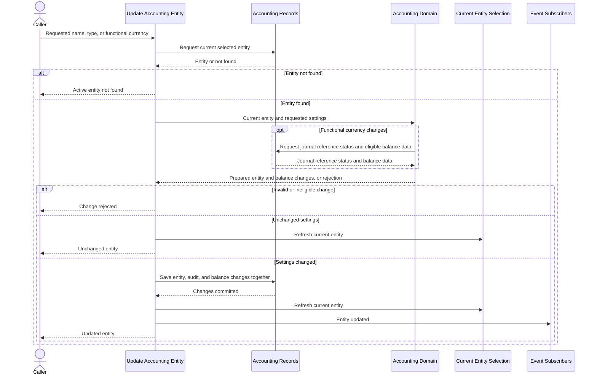

# Update Accounting Entity

```mermaid
sequenceDiagram
    actor Caller
    participant Update as Update Accounting Entity
    participant Records as Accounting Records
    participant Accounting as Accounting Domain
    participant Selection as Current Entity Selection
    participant Events as Event Subscribers

    Caller->>Update: Requested name, type, or functional currency
    Update->>Records: Request current selected entity
    Records-->>Update: Entity or not found
    alt Entity not found
        Update-->>Caller: Active entity not found
    else Entity found
        Update->>Accounting: Current entity and requested settings
        opt Functional currency changes
            Accounting->>Records: Request journal reference status and eligible balance data
            Records-->>Accounting: Journal reference status and balance data
        end
        Accounting-->>Update: Prepared entity and balance changes, or rejection
        alt Invalid or ineligible change
            Update-->>Caller: Change rejected
        else Unchanged settings
            Update->>Selection: Refresh current entity
            Update-->>Caller: Unchanged entity
        else Settings changed
            Update->>Records: Save entity, audit, and balance changes together
            Records-->>Update: Changes committed
            Update->>Selection: Refresh current entity
            Update->>Events: Entity updated
            Update-->>Caller: Updated entity
        end
    end
```
