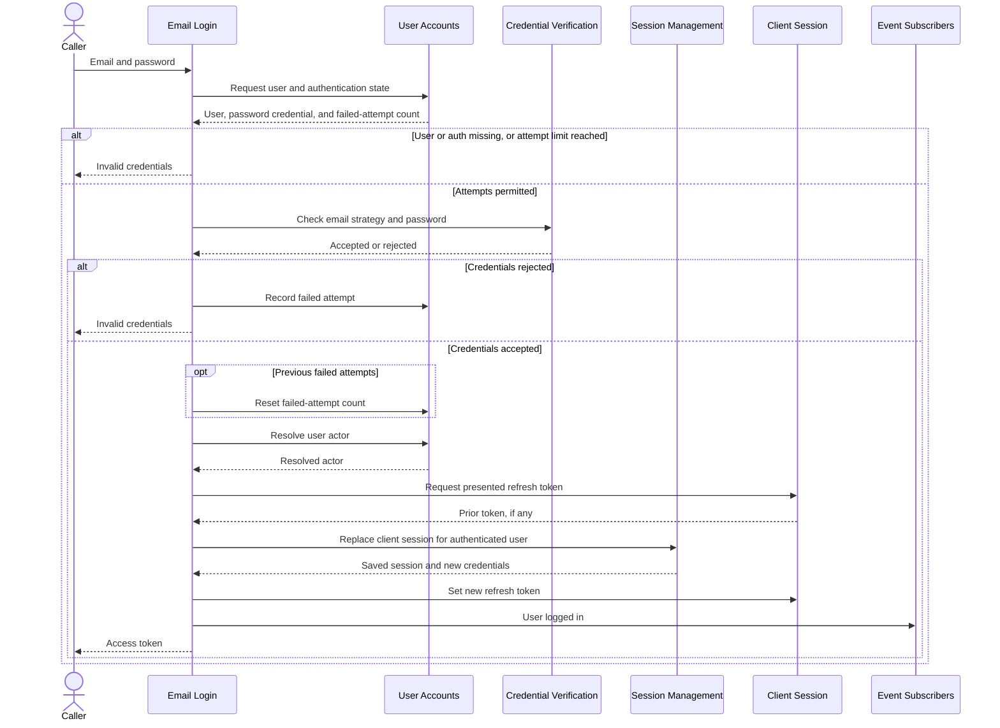

# Login With Email

```mermaid
sequenceDiagram
    actor Caller
    participant Login as Email Login
    participant Accounts as User Accounts
    participant Credentials as Credential Verification
    participant Sessions as Session Management
    participant Client as Client Session
    participant Events as Event Subscribers

    Caller->>Login: Email and password
    Login->>Accounts: Request user and authentication state
    Accounts-->>Login: User, password credential, and failed-attempt count
    alt User or auth missing, or attempt limit reached
        Login-->>Caller: Invalid credentials
    else Attempts permitted
        Login->>Credentials: Check email strategy and password
        Credentials-->>Login: Accepted or rejected
        alt Credentials rejected
            Login->>Accounts: Record failed attempt
            Login-->>Caller: Invalid credentials
        else Credentials accepted
            opt Previous failed attempts
                Login->>Accounts: Reset failed-attempt count
            end
            Login->>Accounts: Resolve user actor
            Accounts-->>Login: Resolved actor
            Login->>Client: Request presented refresh token
            Client-->>Login: Prior token, if any
            Login->>Sessions: Replace client session for authenticated user
            Sessions-->>Login: Saved session and new credentials
            Login->>Client: Set new refresh token
            Login->>Events: User logged in
            Login-->>Caller: Access token
        end
    end
```
