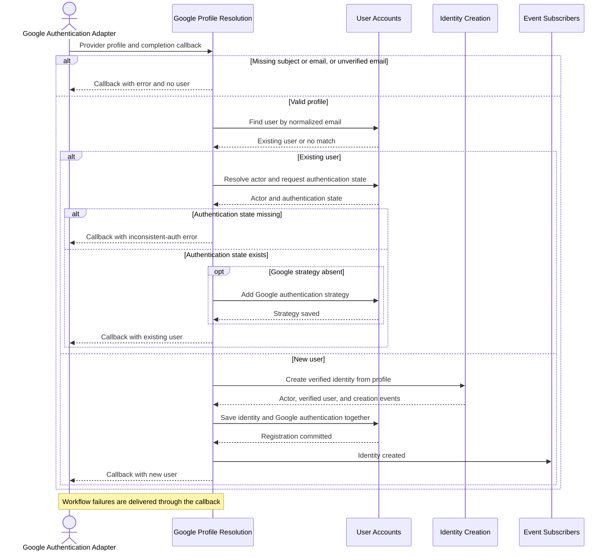

# Login With Google

```mermaid
sequenceDiagram
    actor Adapter as Google Authentication Adapter
    participant Login as Google Profile Resolution
    participant Accounts as User Accounts
    participant Identity as Identity Creation
    participant Events as Event Subscribers

    Adapter->>Login: Provider profile and completion callback
    alt Missing subject or email, or unverified email
        Login-->>Adapter: Callback with error and no user
    else Valid profile
        Login->>Accounts: Find user by normalized email
        Accounts-->>Login: Existing user or no match
        alt Existing user
            Login->>Accounts: Resolve actor and request authentication state
            Accounts-->>Login: Actor and authentication state
            alt Authentication state missing
                Login-->>Adapter: Callback with inconsistent-auth error
            else Authentication state exists
                opt Google strategy absent
                    Login->>Accounts: Add Google authentication strategy
                    Accounts-->>Login: Strategy saved
                end
                Login-->>Adapter: Callback with existing user
            end
        else New user
            Login->>Identity: Create verified identity from profile
            Identity-->>Login: Actor, verified user, and creation events
            Login->>Accounts: Save identity and Google authentication together
            Accounts-->>Login: Registration committed
            Login->>Events: Identity created
            Login-->>Adapter: Callback with new user
        end
    end
    Note over Login,Adapter: Workflow failures are delivered through the callback
```
