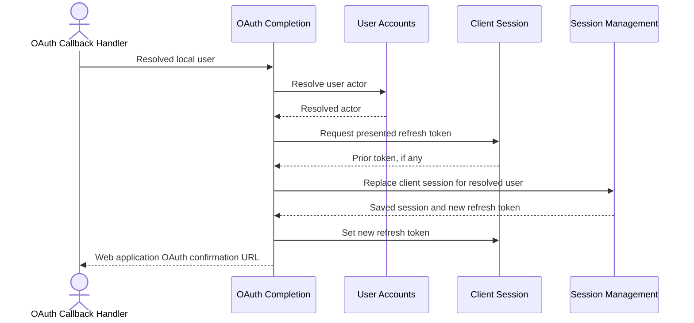

# Complete Google OAuth Sign-In

```mermaid
sequenceDiagram
    actor Caller as OAuth Callback Handler
    participant OAuth as OAuth Completion
    participant Accounts as User Accounts
    participant Client as Client Session
    participant Sessions as Session Management

    Caller->>OAuth: Resolved local user
    OAuth->>Accounts: Resolve user actor
    Accounts-->>OAuth: Resolved actor
    OAuth->>Client: Request presented refresh token
    Client-->>OAuth: Prior token, if any
    OAuth->>Sessions: Replace client session for resolved user
    Sessions-->>OAuth: Saved session and new refresh token
    OAuth->>Client: Set new refresh token
    OAuth-->>Caller: Web application OAuth confirmation URL
```
