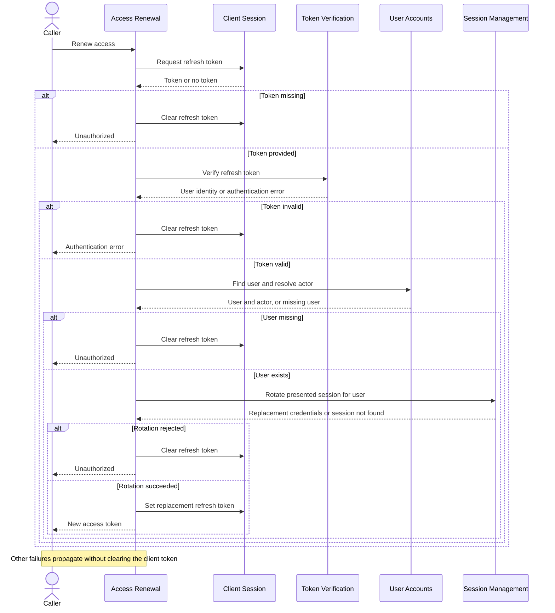

# Refresh Access Token

```mermaid
sequenceDiagram
    actor Caller
    participant Refresh as Access Renewal
    participant Client as Client Session
    participant Tokens as Token Verification
    participant Accounts as User Accounts
    participant Sessions as Session Management

    Caller->>Refresh: Renew access
    Refresh->>Client: Request refresh token
    Client-->>Refresh: Token or no token
    alt Token missing
        Refresh->>Client: Clear refresh token
        Refresh-->>Caller: Unauthorized
    else Token provided
        Refresh->>Tokens: Verify refresh token
        Tokens-->>Refresh: User identity or authentication error
        alt Token invalid
            Refresh->>Client: Clear refresh token
            Refresh-->>Caller: Authentication error
        else Token valid
            Refresh->>Accounts: Find user and resolve actor
            Accounts-->>Refresh: User and actor, or missing user
            alt User missing
                Refresh->>Client: Clear refresh token
                Refresh-->>Caller: Unauthorized
            else User exists
                Refresh->>Sessions: Rotate presented session for user
                Sessions-->>Refresh: Replacement credentials or session not found
                alt Rotation rejected
                    Refresh->>Client: Clear refresh token
                    Refresh-->>Caller: Unauthorized
                else Rotation succeeded
                    Refresh->>Client: Set replacement refresh token
                    Refresh-->>Caller: New access token
                end
            end
        end
    end
    Note over Refresh,Caller: Other failures propagate without clearing the client token
```
