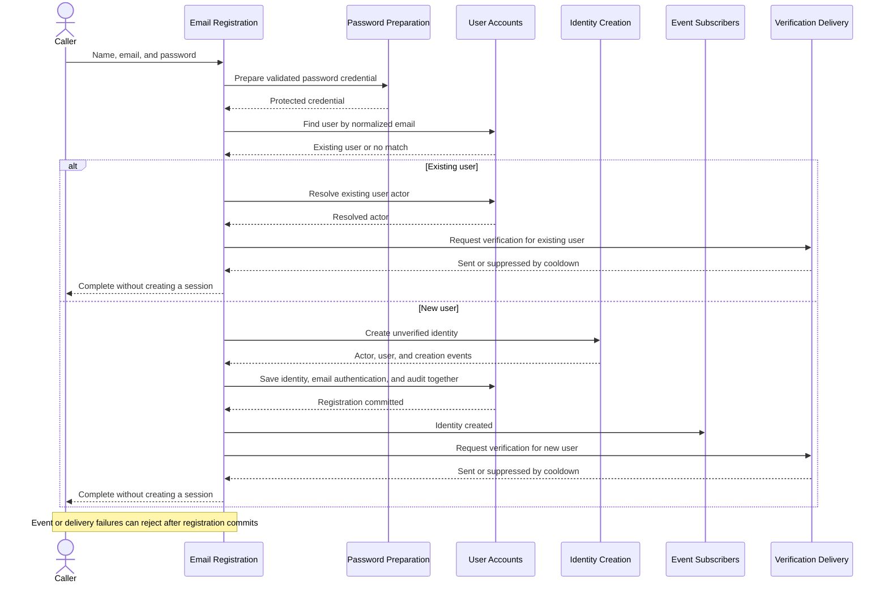

# Sign Up With Email

```mermaid
sequenceDiagram
    actor Caller
    participant Signup as Email Registration
    participant Credentials as Password Preparation
    participant Accounts as User Accounts
    participant Identity as Identity Creation
    participant Events as Event Subscribers
    participant Email as Verification Delivery

    Caller->>Signup: Name, email, and password
    Signup->>Credentials: Prepare validated password credential
    Credentials-->>Signup: Protected credential
    Signup->>Accounts: Find user by normalized email
    Accounts-->>Signup: Existing user or no match
    alt Existing user
        Signup->>Accounts: Resolve existing user actor
        Accounts-->>Signup: Resolved actor
        Signup->>Email: Request verification for existing user
        Email-->>Signup: Sent or suppressed by cooldown
        Signup-->>Caller: Complete without creating a session
    else New user
        Signup->>Identity: Create unverified identity
        Identity-->>Signup: Actor, user, and creation events
        Signup->>Accounts: Save identity, email authentication, and audit together
        Accounts-->>Signup: Registration committed
        Signup->>Events: Identity created
        Signup->>Email: Request verification for new user
        Email-->>Signup: Sent or suppressed by cooldown
        Signup-->>Caller: Complete without creating a session
    end
    Note over Signup,Caller: Event or delivery failures can reject after registration commits
```
