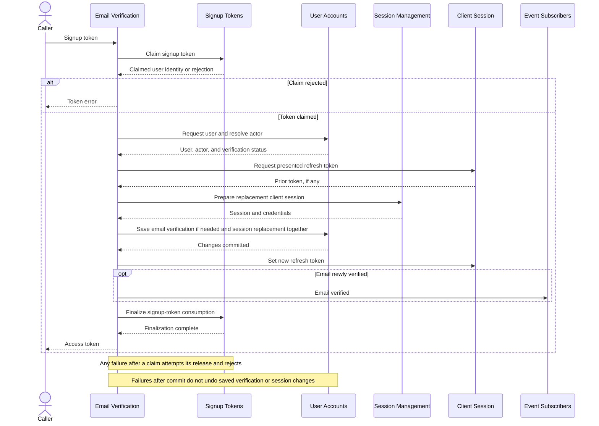

# Verify Email

```mermaid
sequenceDiagram
    actor Caller
    participant Verify as Email Verification
    participant Tokens as Signup Tokens
    participant Accounts as User Accounts
    participant Sessions as Session Management
    participant Client as Client Session
    participant Events as Event Subscribers

    Caller->>Verify: Signup token
    Verify->>Tokens: Claim signup token
    Tokens-->>Verify: Claimed user identity or rejection
    alt Claim rejected
        Verify-->>Caller: Token error
    else Token claimed
        Verify->>Accounts: Request user and resolve actor
        Accounts-->>Verify: User, actor, and verification status
        Verify->>Client: Request presented refresh token
        Client-->>Verify: Prior token, if any
        Verify->>Sessions: Prepare replacement client session
        Sessions-->>Verify: Session and credentials
        Verify->>Accounts: Save email verification if needed and session replacement together
        Accounts-->>Verify: Changes committed
        Verify->>Client: Set new refresh token
        opt Email newly verified
            Verify->>Events: Email verified
        end
        Verify->>Tokens: Finalize signup-token consumption
        Tokens-->>Verify: Finalization complete
        Verify-->>Caller: Access token
    end
    Note over Verify,Tokens: Any failure after a claim attempts its release and rejects
    Note over Verify,Accounts: Failures after commit do not undo saved verification or session changes
```
