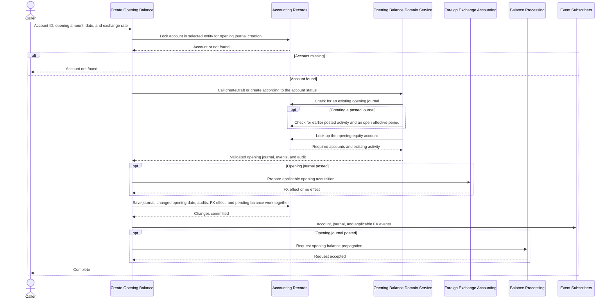

# Create Opening Balance

```mermaid
sequenceDiagram
    actor Caller
    participant CreateUseCase as Create Opening Balance
    participant Records as Accounting Records
    participant Opening as Opening Balance Domain Service
    participant FX as Foreign Exchange Accounting
    participant Balances as Balance Processing
    participant Events as Event Subscribers

    Caller->>CreateUseCase: Account ID, opening amount, date, and exchange rate
    CreateUseCase->>Records: Lock account in selected entity for opening journal creation
    Records-->>CreateUseCase: Account or not found
    alt Account missing
        CreateUseCase-->>Caller: Account not found
    else Account found
        CreateUseCase->>Opening: Call createDraft or create according to the account status
        Opening->>Records: Check for an existing opening journal
        opt Creating a posted journal
            Opening->>Records: Check for earlier posted activity and an open effective period
        end
        Opening->>Records: Look up the opening equity account
        Records-->>Opening: Required accounts and existing activity
        Opening-->>CreateUseCase: Validated opening journal, events, and audit
        opt Opening journal posted
            CreateUseCase->>FX: Prepare applicable opening acquisition
            FX-->>CreateUseCase: FX effect or no effect
        end
        CreateUseCase->>Records: Save journal, changed opening date, audits, FX effect, and pending balance work together
        Records-->>CreateUseCase: Changes committed
        CreateUseCase->>Events: Account, journal, and applicable FX events
        opt Opening journal posted
            CreateUseCase->>Balances: Request opening balance propagation
            Balances-->>CreateUseCase: Request accepted
        end
        CreateUseCase-->>Caller: Complete
    end
```
