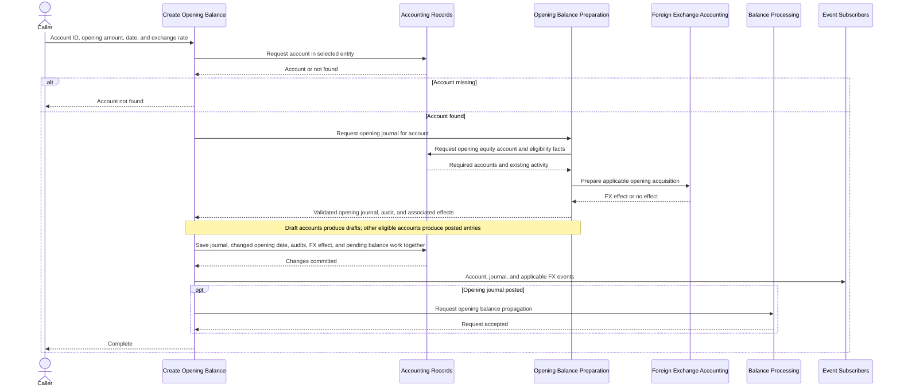

# Create Opening Balance

```mermaid
sequenceDiagram
    actor Caller
    participant CreateUseCase as Create Opening Balance
    participant Records as Accounting Records
    participant Opening as Opening Balance Preparation
    participant FX as Foreign Exchange Accounting
    participant Balances as Balance Processing
    participant Events as Event Subscribers

    Caller->>CreateUseCase: Account ID, opening amount, date, and exchange rate
    CreateUseCase->>Records: Request account in selected entity
    Records-->>CreateUseCase: Account or not found
    alt Account missing
        CreateUseCase-->>Caller: Account not found
    else Account found
        CreateUseCase->>Opening: Request opening journal for account
        Opening->>Records: Request opening equity account and eligibility facts
        Records-->>Opening: Required accounts and existing activity
        Opening->>FX: Prepare applicable opening acquisition
        FX-->>Opening: FX effect or no effect
        Opening-->>CreateUseCase: Validated opening journal, audit, and associated effects
        Note over Opening,CreateUseCase: Draft accounts produce drafts#59; other eligible accounts produce posted entries
        CreateUseCase->>Records: Save journal, changed opening date, audits, FX effect, and pending balance work together
        Records-->>CreateUseCase: Changes committed
        CreateUseCase->>Events: Account, journal, and applicable FX events
        opt Opening journal posted
            CreateUseCase->>Balances: Request opening balance propagation
            Balances-->>CreateUseCase: Request accepted
        end
        CreateUseCase-->>Caller: Complete
    end
```
