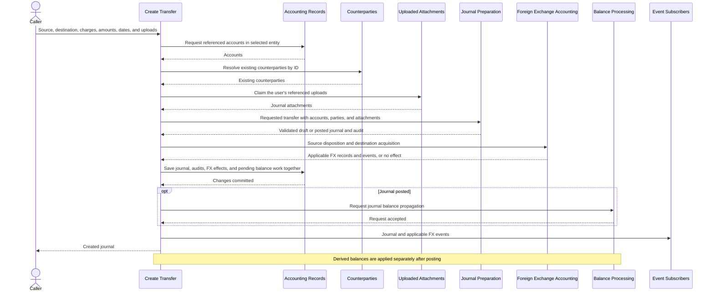

# Create Transfer

```mermaid
sequenceDiagram
    actor Caller
    participant CreateUseCase as Create Transfer
    participant Records as Accounting Records
    participant Parties as Counterparties
    participant Files as Uploaded Attachments
    participant Journal as Journal Preparation
    participant FX as Foreign Exchange Accounting
    participant Balances as Balance Processing
    participant Events as Event Subscribers

    Caller->>CreateUseCase: Source, destination, charges, amounts, dates, and uploads
    CreateUseCase->>Records: Request referenced accounts in selected entity
    Records-->>CreateUseCase: Accounts
    CreateUseCase->>Parties: Resolve existing counterparties by ID
    Parties-->>CreateUseCase: Existing counterparties
    CreateUseCase->>Files: Claim the user's referenced uploads
    Files-->>CreateUseCase: Journal attachments
    CreateUseCase->>Journal: Requested transfer with accounts, parties, and attachments
    Journal-->>CreateUseCase: Validated draft or posted journal and audit
    CreateUseCase->>FX: Source disposition and destination acquisition
    FX-->>CreateUseCase: Applicable FX records and events, or no effect
    CreateUseCase->>Records: Save journal, audits, FX effects, and pending balance work together
    Records-->>CreateUseCase: Changes committed
    opt Journal posted
        CreateUseCase->>Balances: Request journal balance propagation
        Balances-->>CreateUseCase: Request accepted
    end
    CreateUseCase->>Events: Journal and applicable FX events
    CreateUseCase-->>Caller: Created journal
    Note over CreateUseCase,Balances: Derived balances are applied separately after posting
```
