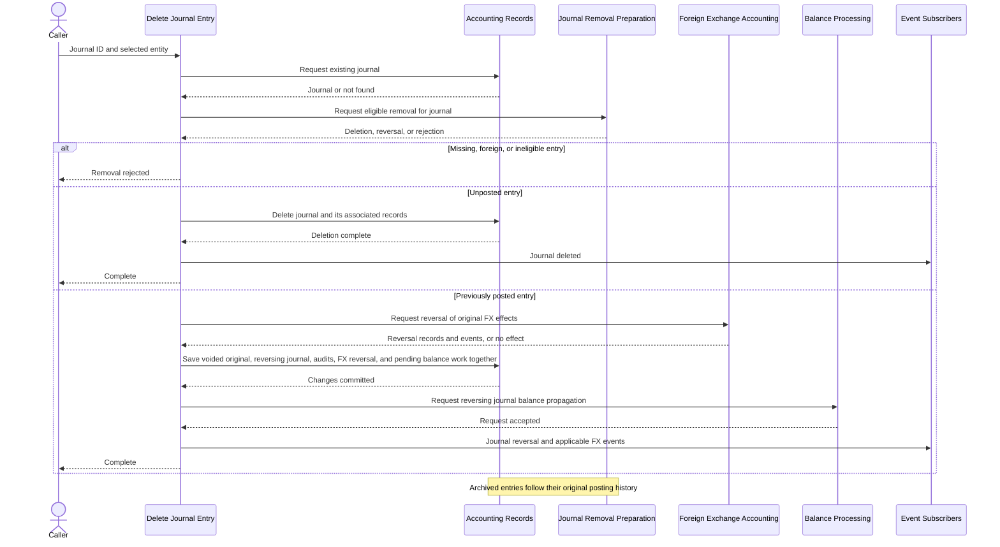

# Delete Journal Entry

```mermaid
sequenceDiagram
    actor Caller
    participant Delete as Delete Journal Entry
    participant Records as Accounting Records
    participant Removal as Journal Removal Preparation
    participant FX as Foreign Exchange Accounting
    participant Balances as Balance Processing
    participant Events as Event Subscribers

    Caller->>Delete: Journal ID and selected entity
    Delete->>Records: Request existing journal
    Records-->>Delete: Journal or not found
    Delete->>Removal: Request eligible removal for journal
    Removal-->>Delete: Deletion, reversal, or rejection
    alt Missing, foreign, or ineligible entry
        Delete-->>Caller: Removal rejected
    else Unposted entry
        Delete->>Records: Delete journal and its associated records
        Records-->>Delete: Deletion complete
        Delete->>Events: Journal deleted
        Delete-->>Caller: Complete
    else Previously posted entry
        Delete->>FX: Request reversal of original FX effects
        FX-->>Delete: Reversal records and events, or no effect
        Delete->>Records: Save voided original, reversing journal, audits, FX reversal, and pending balance work together
        Records-->>Delete: Changes committed
        Delete->>Balances: Request reversing journal balance propagation
        Balances-->>Delete: Request accepted
        Delete->>Events: Journal reversal and applicable FX events
        Delete-->>Caller: Complete
    end
    Note over Removal,Records: Archived entries follow their original posting history
```
