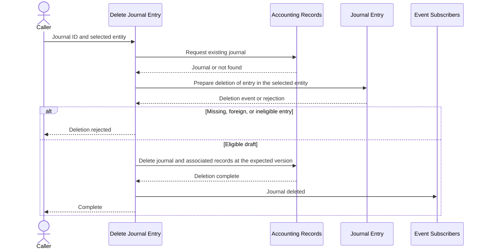

# Delete Journal Entry

```mermaid
sequenceDiagram
    actor Caller
    participant Delete as Delete Journal Entry
    participant Records as Accounting Records
    participant Journal as Journal Entry
    participant Events as Event Subscribers

    Caller->>Delete: Journal ID and selected entity
    Delete->>Records: Request existing journal
    Records-->>Delete: Journal or not found
    Delete->>Journal: Prepare deletion of entry in the selected entity
    Journal-->>Delete: Deletion event or rejection
    alt Missing, foreign, or ineligible entry
        Delete-->>Caller: Deletion rejected
    else Eligible draft
        Delete->>Records: Delete journal and associated records at the expected version
        Records-->>Delete: Deletion complete
        Delete->>Events: Journal deleted
        Delete-->>Caller: Complete
    end
```
