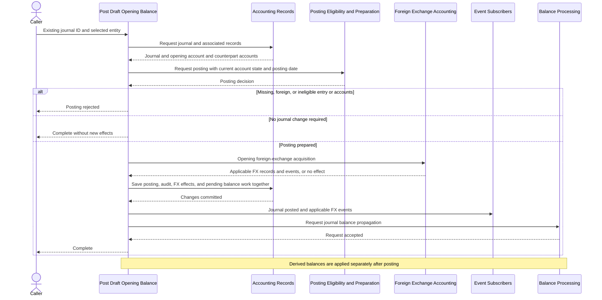

# Post Draft Opening Balance

```mermaid
sequenceDiagram
    actor Caller
    participant Post as Post Draft Opening Balance
    participant Records as Accounting Records
    participant Journal as Posting Eligibility and Preparation
    participant FX as Foreign Exchange Accounting
    participant Events as Event Subscribers
    participant Balances as Balance Processing

    Caller->>Post: Existing journal ID and selected entity
    Post->>Records: Request journal and associated records
    Records-->>Post: Journal and opening account and counterpart accounts
    Post->>Journal: Request posting with current account state and posting date
    Journal-->>Post: Posting decision
    alt Missing, foreign, or ineligible entry or accounts
        Post-->>Caller: Posting rejected
    else No journal change required
        Post-->>Caller: Complete without new effects
    else Posting prepared
        Post->>FX: Opening foreign-exchange acquisition
        FX-->>Post: Applicable FX records and events, or no effect
        Post->>Records: Save posting, audit, FX effects, and pending balance work together
        Records-->>Post: Changes committed
        Post->>Events: Journal posted and applicable FX events
        Post->>Balances: Request journal balance propagation
        Balances-->>Post: Request accepted
        Post-->>Caller: Complete
    end
    Note over Post,Balances: Derived balances are applied separately after posting
```
