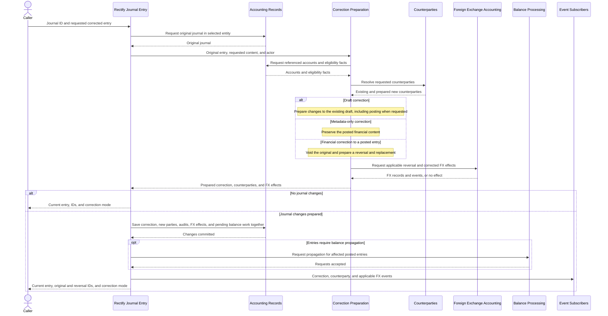

# Rectify Journal Entry

```mermaid
sequenceDiagram
    actor Caller
    participant Rectify as Rectify Journal Entry
    participant Records as Accounting Records
    participant Correction as Correction Preparation
    participant Parties as Counterparties
    participant FX as Foreign Exchange Accounting
    participant Balances as Balance Processing
    participant Events as Event Subscribers

    Caller->>Rectify: Journal ID and requested corrected entry
    Rectify->>Records: Request original journal in selected entity
    Records-->>Rectify: Original journal
    Rectify->>Correction: Original entry, requested content, and actor
    Correction->>Records: Request referenced accounts and eligibility facts
    Records-->>Correction: Accounts and eligibility facts
    Correction->>Parties: Resolve requested counterparties
    Parties-->>Correction: Existing and prepared new counterparties
    alt Draft correction
        Note over Correction: Prepare changes to the existing draft, including posting when requested
    else Metadata-only correction
        Note over Correction: Preserve the posted financial content
    else Financial correction to a posted entry
        Note over Correction: Void the original and prepare a reversal and replacement
    end
    Correction->>FX: Request applicable reversal and corrected FX effects
    FX-->>Correction: FX records and events, or no effect
    Correction-->>Rectify: Prepared correction, counterparties, and FX effects
    alt No journal changes
        Rectify-->>Caller: Current entry, IDs, and correction mode
    else Journal changes prepared
        Rectify->>Records: Save correction, new parties, audits, FX effects, and pending balance work together
        Records-->>Rectify: Changes committed
        opt Entries require balance propagation
            Rectify->>Balances: Request propagation for affected posted entries
            Balances-->>Rectify: Requests accepted
        end
        Rectify->>Events: Correction, counterparty, and applicable FX events
        Rectify-->>Caller: Current entry, original and reversal IDs, and correction mode
    end
```
