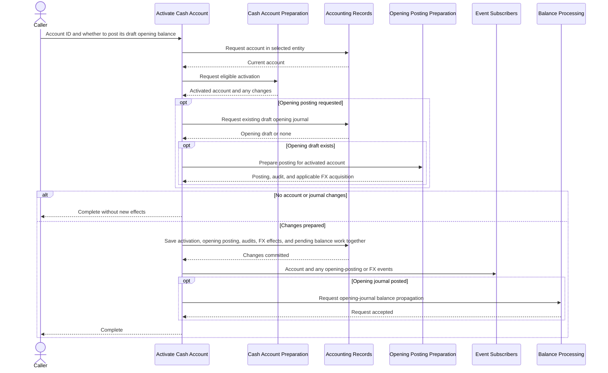

# Activate Cash Account

```mermaid
sequenceDiagram
    actor Caller
    participant ActivateUseCase as Activate Cash Account
    participant Accounts as Cash Account Preparation
    participant Records as Accounting Records
    participant Opening as Opening Posting Preparation
    participant Events as Event Subscribers
    participant Balances as Balance Processing

    Caller->>ActivateUseCase: Account ID and whether to post its draft opening balance
    ActivateUseCase->>Records: Request account in selected entity
    Records-->>ActivateUseCase: Current account
    ActivateUseCase->>Accounts: Request eligible activation
    Accounts-->>ActivateUseCase: Activated account and any changes
    opt Opening posting requested
        ActivateUseCase->>Records: Request existing draft opening journal
        Records-->>ActivateUseCase: Opening draft or none
        opt Opening draft exists
            ActivateUseCase->>Opening: Prepare posting for activated account
            Opening-->>ActivateUseCase: Posting, audit, and applicable FX acquisition
        end
    end
    alt No account or journal changes
        ActivateUseCase-->>Caller: Complete without new effects
    else Changes prepared
        ActivateUseCase->>Records: Save activation, opening posting, audits, FX effects, and pending balance work together
        Records-->>ActivateUseCase: Changes committed
        ActivateUseCase->>Events: Account and any opening-posting or FX events
        opt Opening journal posted
            ActivateUseCase->>Balances: Request opening-journal balance propagation
            Balances-->>ActivateUseCase: Request accepted
        end
        ActivateUseCase-->>Caller: Complete
    end
```
