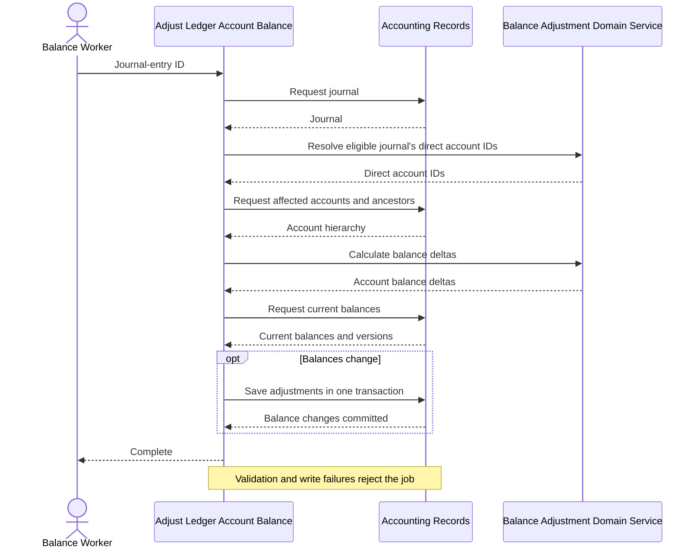

# Adjust Ledger Account Balance

```mermaid
sequenceDiagram
    actor Worker as Balance Worker
    participant Adjust as Adjust Ledger Account Balance
    participant Records as Accounting Records
    participant Adjustment as Balance Adjustment Domain Service
    Worker->>Adjust: Journal-entry ID
    Adjust->>Records: Request journal
    Records-->>Adjust: Journal
    Adjust->>Adjustment: Resolve eligible journal's direct account IDs
    Adjustment-->>Adjust: Direct account IDs
    Adjust->>Records: Request affected accounts and ancestors
    Records-->>Adjust: Account hierarchy
    Adjust->>Adjustment: Calculate balance deltas
    Adjustment-->>Adjust: Account balance deltas
    Adjust->>Records: Request current balances
    Records-->>Adjust: Current balances and versions
    opt Balances change
        Adjust->>Records: Save adjustments in one transaction
        Records-->>Adjust: Balance changes committed
    end
    Adjust-->>Worker: Complete
    Note over Adjust,Records: Validation and write failures reject the job
```
