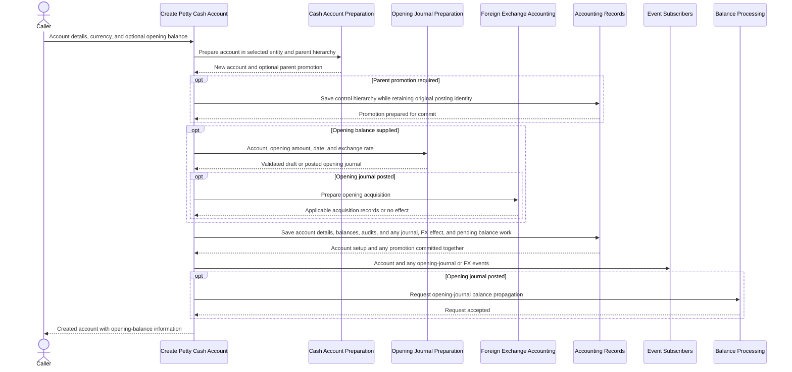

# Create Petty Cash Account

```mermaid
sequenceDiagram
    actor Caller
    participant CreateUseCase as Create Petty Cash Account
    participant Accounts as Cash Account Preparation
    participant Opening as Opening Journal Preparation
    participant FX as Foreign Exchange Accounting
    participant Records as Accounting Records
    participant Events as Event Subscribers
    participant Balances as Balance Processing

    Caller->>CreateUseCase: Account details, currency, and optional opening balance
    CreateUseCase->>Accounts: Prepare account in selected entity and parent hierarchy
    Accounts-->>CreateUseCase: New account and optional parent promotion
    opt Parent promotion required
        CreateUseCase->>Records: Save control hierarchy while retaining original posting identity
        Records-->>CreateUseCase: Promotion prepared for commit
    end
    opt Opening balance supplied
        CreateUseCase->>Opening: Account, opening amount, date, and exchange rate
        Opening-->>CreateUseCase: Validated draft or posted opening journal
        opt Opening journal posted
            CreateUseCase->>FX: Prepare opening acquisition
            FX-->>CreateUseCase: Applicable acquisition records or no effect
        end
    end
    CreateUseCase->>Records: Save account details, balances, audits, and any journal, FX effect, and pending balance work
    Records-->>CreateUseCase: Account setup and any promotion committed together
    CreateUseCase->>Events: Account and any opening-journal or FX events
    opt Opening journal posted
        CreateUseCase->>Balances: Request opening-journal balance propagation
        Balances-->>CreateUseCase: Request accepted
    end
    CreateUseCase-->>Caller: Created account with opening-balance information
```
