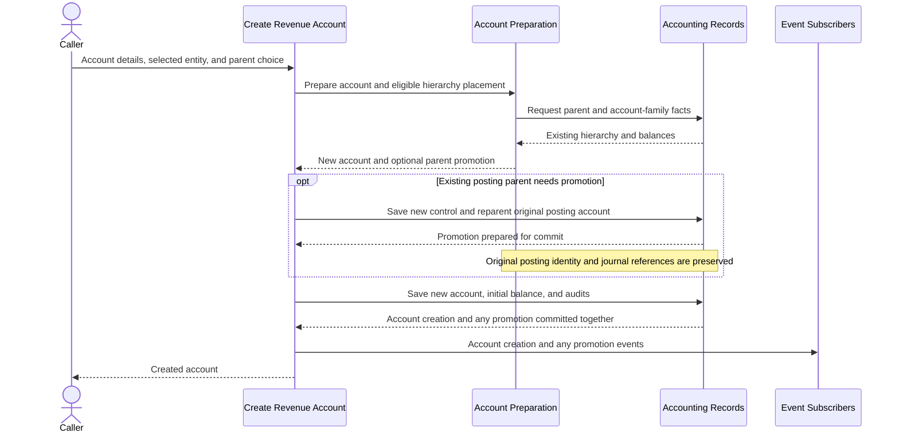

# Create Revenue Account

```mermaid
sequenceDiagram
    actor Caller
    participant CreateUseCase as Create Revenue Account
    participant Accounts as Account Preparation
    participant Records as Accounting Records
    participant Events as Event Subscribers

    Caller->>CreateUseCase: Account details, selected entity, and parent choice
    CreateUseCase->>Accounts: Prepare account and eligible hierarchy placement
    Accounts->>Records: Request parent and account-family facts
    Records-->>Accounts: Existing hierarchy and balances
    Accounts-->>CreateUseCase: New account and optional parent promotion
    opt Existing posting parent needs promotion
        CreateUseCase->>Records: Save new control and reparent original posting account
        Records-->>CreateUseCase: Promotion prepared for commit
        Note over Accounts,Records: Original posting identity and journal references are preserved
    end
    CreateUseCase->>Records: Save new account, initial balance, and audits
    Records-->>CreateUseCase: Account creation and any promotion committed together
    CreateUseCase->>Events: Account creation and any promotion events
    CreateUseCase-->>Caller: Created account
```
