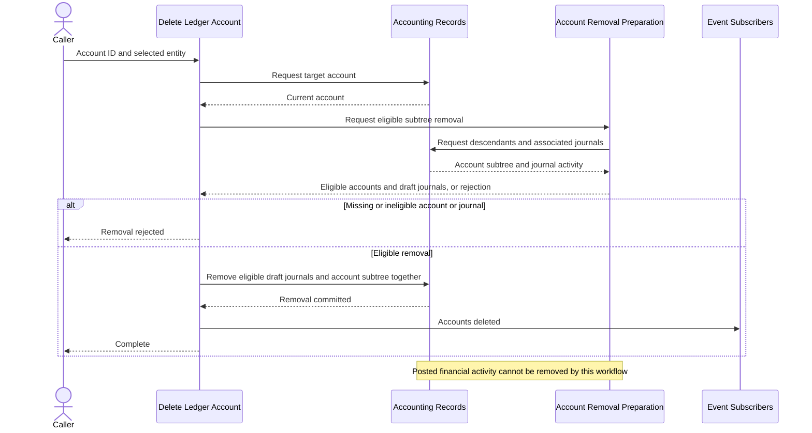

# Delete Ledger Account

```mermaid
sequenceDiagram
    actor Caller
    participant Delete as Delete Ledger Account
    participant Records as Accounting Records
    participant Accounts as Account Removal Preparation
    participant Events as Event Subscribers

    Caller->>Delete: Account ID and selected entity
    Delete->>Records: Request target account
    Records-->>Delete: Current account
    Delete->>Accounts: Request eligible subtree removal
    Accounts->>Records: Request descendants and associated journals
    Records-->>Accounts: Account subtree and journal activity
    Accounts-->>Delete: Eligible accounts and draft journals, or rejection
    alt Missing or ineligible account or journal
        Delete-->>Caller: Removal rejected
    else Eligible removal
        Delete->>Records: Remove eligible draft journals and account subtree together
        Records-->>Delete: Removal committed
        Delete->>Events: Accounts deleted
        Delete-->>Caller: Complete
    end
    Note over Accounts,Records: Posted financial activity cannot be removed by this workflow
```
