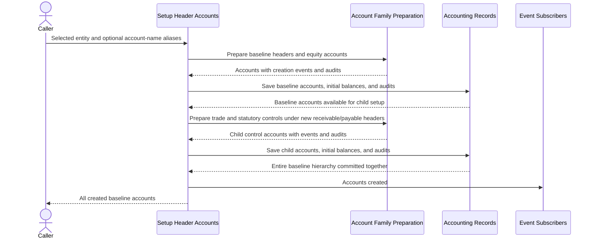

# Setup Header Accounts

```mermaid
sequenceDiagram
    actor Caller
    participant Setup as Setup Header Accounts
    participant Accounts as Account Family Preparation
    participant Records as Accounting Records
    participant Events as Event Subscribers

    Caller->>Setup: Selected entity and optional account-name aliases
    Setup->>Accounts: Prepare baseline headers and equity accounts
    Accounts-->>Setup: Accounts with creation events and audits
    Setup->>Records: Save baseline accounts, initial balances, and audits
    Records-->>Setup: Baseline accounts available for child setup
    Setup->>Accounts: Prepare trade and statutory controls under new receivable/payable headers
    Accounts-->>Setup: Child control accounts with events and audits
    Setup->>Records: Save child accounts, initial balances, and audits
    Records-->>Setup: Entire baseline hierarchy committed together
    Setup->>Events: Accounts created
    Setup-->>Caller: All created baseline accounts
```
