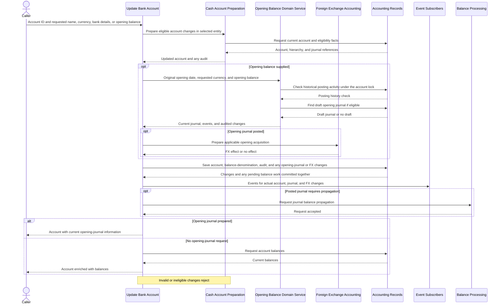

# Update Bank Account

```mermaid
sequenceDiagram
    actor Caller
    participant Update as Update Bank Account
    participant Accounts as Cash Account Preparation
    participant Opening as Opening Balance Domain Service
    participant FX as Foreign Exchange Accounting
    participant Records as Accounting Records
    participant Events as Event Subscribers
    participant Balances as Balance Processing

    Caller->>Update: Account ID and requested name, currency, bank details, or opening balance
    Update->>Accounts: Prepare eligible account changes in selected entity
    Accounts->>Records: Request current account and eligibility facts
    Records-->>Accounts: Account, hierarchy, and journal references
    Accounts-->>Update: Updated account and any audit
    opt Opening balance supplied
        Update->>Opening: Original opening date, requested currency, and opening balance
        Opening->>Records: Check historical posting activity under the account lock
        Records-->>Opening: Posting history check
        Opening->>Records: Find draft opening journal if eligible
        Records-->>Opening: Draft journal or no draft
        Opening-->>Update: Current journal, events, and audited changes
        opt Opening journal posted
            Update->>FX: Prepare applicable opening acquisition
            FX-->>Update: FX effect or no effect
        end
    end
    Update->>Records: Save account, balance-denomination, audit, and any opening-journal or FX changes
    Records-->>Update: Changes and any pending balance work committed together
    Update->>Events: Events for actual account, journal, and FX changes
    opt Posted journal requires propagation
        Update->>Balances: Request journal balance propagation
        Balances-->>Update: Request accepted
    end
    alt Opening journal prepared
        Update-->>Caller: Account with current opening-journal information
    else No opening-journal request
        Update->>Records: Request account balances
        Records-->>Update: Current balances
        Update-->>Caller: Account enriched with balances
    end
    Note over Update,Accounts: Invalid or ineligible changes reject
```
