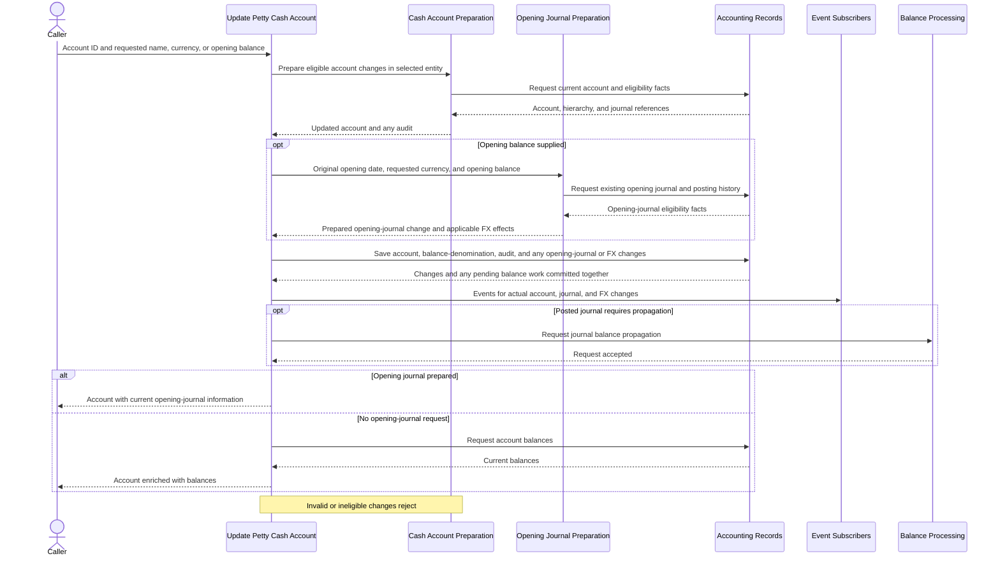

# Update Petty Cash Account

```mermaid
sequenceDiagram
    actor Caller
    participant Update as Update Petty Cash Account
    participant Accounts as Cash Account Preparation
    participant Opening as Opening Journal Preparation
    participant Records as Accounting Records
    participant Events as Event Subscribers
    participant Balances as Balance Processing

    Caller->>Update: Account ID and requested name, currency, or opening balance
    Update->>Accounts: Prepare eligible account changes in selected entity
    Accounts->>Records: Request current account and eligibility facts
    Records-->>Accounts: Account, hierarchy, and journal references
    Accounts-->>Update: Updated account and any audit
    opt Opening balance supplied
        Update->>Opening: Original opening date, requested currency, and opening balance
        Opening->>Records: Request existing opening journal and posting history
        Records-->>Opening: Opening-journal eligibility facts
        Opening-->>Update: Prepared opening-journal change and applicable FX effects
    end
    Update->>Records: Save account, balance-denomination, audit, and any opening-journal or FX changes
    Records-->>Update: Changes and any pending balance work committed together
    Update->>Events: Events for actual account, journal, and FX changes
    opt Posted journal requires propagation
        Update->>Balances: Request journal balance propagation
        Balances-->>Update: Request accepted
    end
    alt Opening journal prepared
        Update-->>Caller: Account with current opening-journal information
    else No opening-journal request
        Update->>Records: Request account balances
        Records-->>Update: Current balances
        Update-->>Caller: Account enriched with balances
    end
    Note over Update,Accounts: Invalid or ineligible changes reject
```
